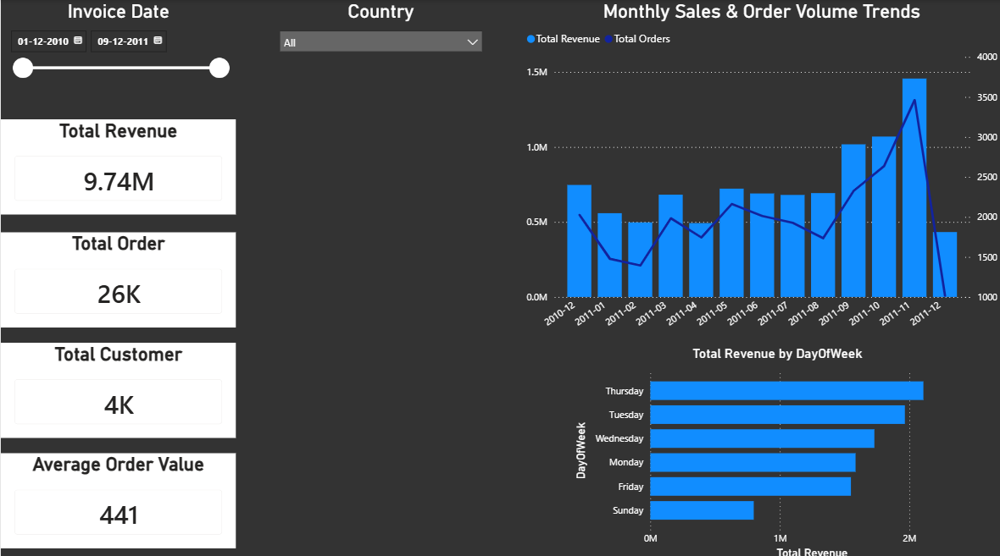
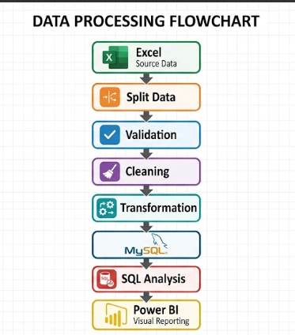
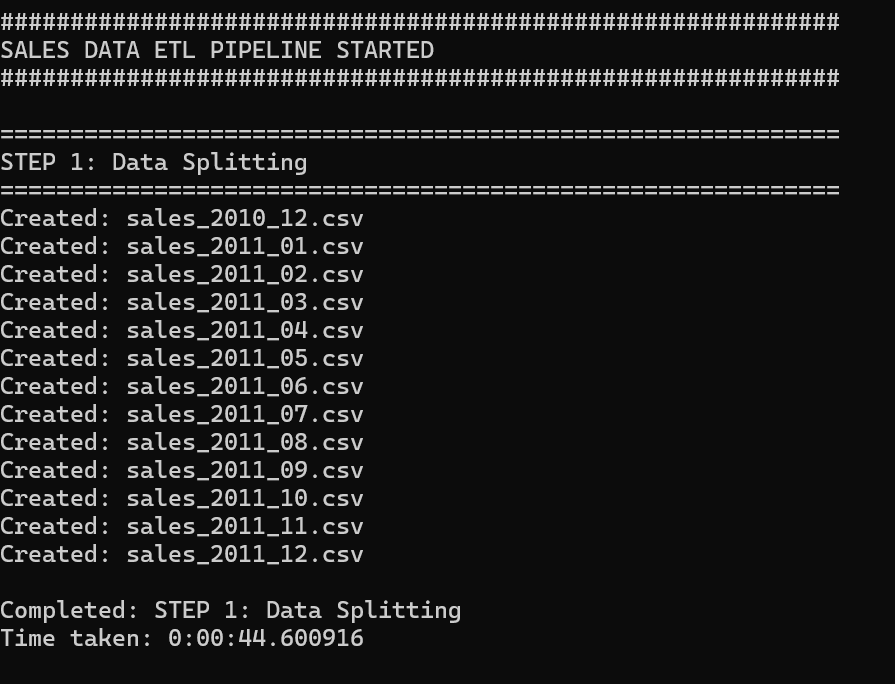
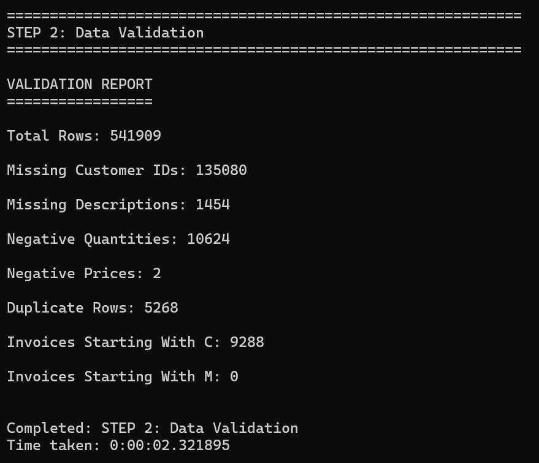
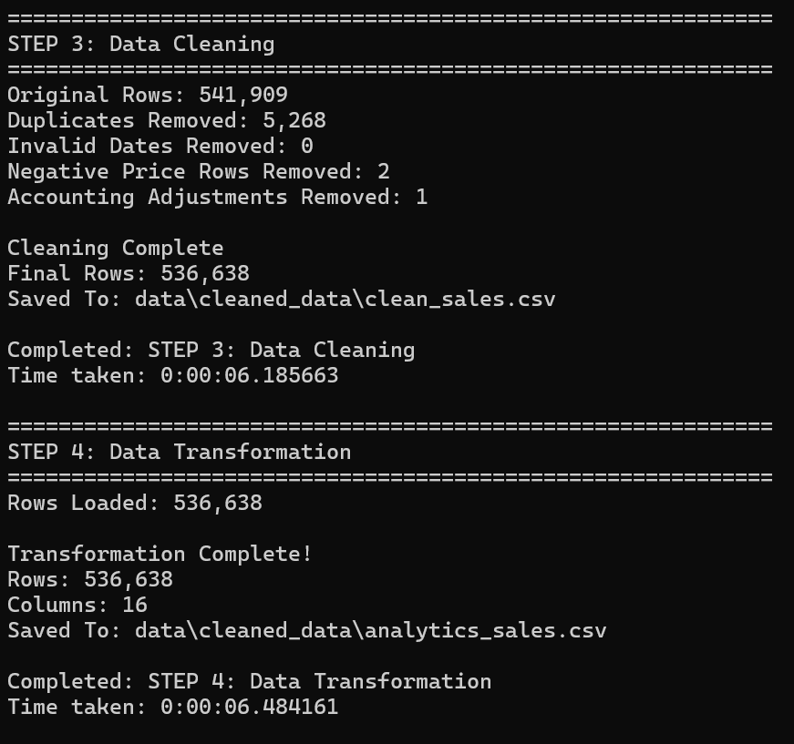
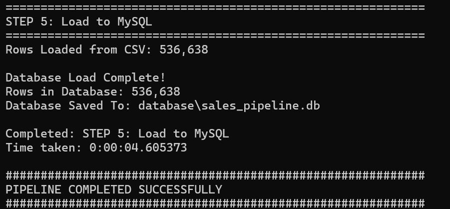
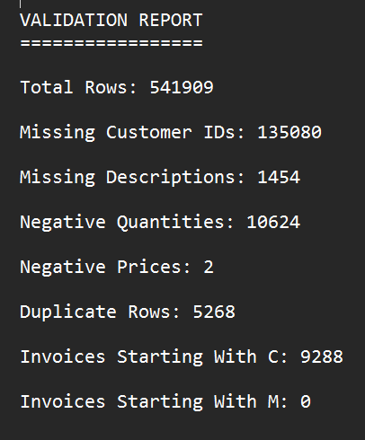

# 📊 Automated Sales Data Pipeline & Analytics System

> Automated ETL pipeline built using Python, MySQL and Power BI that processes over 540k retail transactions.

Features:

- Data Validation
- Data Cleaning
- Feature Engineering
- SQL Analytics
- Interactive Dashboard
- Automated Pipeline.

---

## Dashboard Preview



# Table of Contents

- [Project Overview](#project-overview)
- [Business Problem](#business-problem)
- [Project Objectives](#project-objectives)
- [Solution Architecture](#solution-architecture)
- [Technology Stack](#technology-stack)
- [Dataset](#dataset)
- [Project Workflow](#project-workflow)
- [Pipeline Stages](#pipeline-stages)
  - [1. Data Ingestion](#1-data-ingestion)
  - [2. Data Validation](#2-data-validation)
  - [3. Data Cleaning](#3-data-cleaning)
  - [4. Data Transformation](#4-data-transformation)
- [SQL Database](#sql-database)
- [SQL Analytics](#sql-analytics)
- [Power BI Dashboard](#power-bi-dashboard)
- [Pipeline Automation](#pipeline-automation)
- [Folder Structure](#folder-structure)
- [Results & Key Metrics](#results--key-metrics)
- [Challenges Faced](#challenges-faced)
- [Future Improvements](#future-improvements)
- [Skills Demonstrated](#skills-demonstrated)
- [How to Run](#how-to-run)
- [Author](#author)

---

# Project Overview

This project implements a fully automated production-grade ETL (Extract, Transform, Load) pipeline designed to process raw, messy retail transaction data into clean, business-ready analytics assets. By replacing manual, error-prone data preparation routines with automated scripts, the system establishes a resilient pipeline capable of parsing large transaction sheets, enforcing strict validation checks, and maintaining data warehouse tables.

In a production scenario, manual data preparation acts as a major operational bottleneck. This project highlights how automated pipeline workflows enable engineering teams to continuously stream multi-period datasets directly into scalable relational layers. It minimizes reporting delays and ensures that analytical dashboards draw insights from a standardized, highly verifiable source of truth.

Developed to simulate the rigorous workflow of a Data Analyst and Data Engineer, the system extracts data from unoptimized source spreadsheets, runs multi-stage analytical validations using Python, updates an enterprise relational layer, and provides business decision-makers with core key performance indicators (KPIs) through interactive Power BI reports.

---

# Business Problem

A multinational retail vendor collects thousands of transactional records from multiple operating regions every month. In its raw form, this information arrives plagued by structural anomalies: missing customer logs, duplicate transaction entries, inconsistent date formatting, non-standard retail adjustment markers, and unflagged product returns.

Because corporate business analysts spend excessive manual hours cleaning raw sheets within Excel before building reporting models, critical operational performance updates are routinely delayed. Manual extraction patterns introduces substantial human-error risks into high-level strategic summaries, leaving the company vulnerable to inaccurate profit margins and miscalculated return rates.

---

# Project Objectives

The primary objectives of this system architecture include:

- **Automate Data Ingestion:** Systematically read and slice large multi-month spreadsheets into modular, date-stamped file groups for incremental validation tracking.
- **Enforce Strict Quality Assurance:** Run pre-cleaning structural validations to flag data missingness, logical impossibilities, and negative pricing discrepancies before data modifies downstream systems.
- **Standardize Inconsistent Records:** Programmatically drop redundant entries, resolve null classifications, isolate valid date arrays, and weed out bad debt adjustments.
- **Engineer Business Features:** Transform baseline dimensions into analytical vectors such as time-intelligence keys, localized day-of-week strings, and return-type identifiers.
- **Deploy Scalable Storage:** Build a stable schema and load the transformed records into an engine optimized for rapid business query executions.
- **Surface Operational Insights:** Generate executive KPIs and historical trends via structured queries and highly interactive corporate dashboards.

---

# Solution Architecture

```text
Raw Excel Dataset (.xlsx)
        │
        ▼
[split_data.py] ──> Slices master file into Monthly CSVs
        │
        ▼
[validation.py] ──> Pre-cleaning audit (Generates Validation Report)
        │
        ▼
[cleaning.py] ──> Standardizes nulls, drops duplicates & adjustments
        │
        ▼
[transformation.py] ──> Feature engineering (Revenue, Time Dimensions)
        │
        ▼
[load_to_sql.py] ──> Populates Relational Database Engine
        │
        ▼
   SQL Engine <─── [SQL Analytics Scripts] (Extracts deep insights)
        │
        ▼
Power BI Desktop ──> Processes data models & loads visualizations
```



# Technology Stack

| Category                    | Technology      | Usage                                                                     |
| :-------------------------- | :-------------- | :------------------------------------------------------------------------ |
| **Language**                | Python          | Core scripting engine driving ETL pipeline steps.                         |
| **Data Processing**         | Pandas          | High-performance dataframe operations for vector analysis and formatting. |
| **Numerical Computing**     | NumPy           | Powering fast element-wise mapping and logical evaluations.               |
| **Database Management**     | MySQL / SQLite  | Target relational tier hosting structured analytics tables.               |
| **Database Interaction**    | MySQL Workbench | IDE leveraged to test execution paths, check indexes, and run analytics.  |
| **Business Intelligence**   | Power BI        | Corporate data modeling engine and dashboarding canvas.                   |
| **Version Control**         | Git             | Distributed repository tracking for software lifecycle stability.         |
| **Development Environment** | VS Code         | Primary code base editor used to construct processing script files.       |

# Dataset

- **Dataset Name:** Online Retail Transactional Log
- **Record Count:** Over 540,000 raw transaction rows
- **Temporal Range:** December 2010 to December 2011
- **Attributes Included:**
  - `InvoiceNo`: Unique 6-digit transaction ledger index (prefixed with 'C' for product returns).
  - `StockCode`: Unique item SKU identification string code.
  - `Description`: Product title descriptor name.
  - `Quantity`: Aggregate unit volume counts handled per transaction line.
  - `InvoiceDate`: Explicit day-and-time matrix detailing the sale transaction.
  - `UnitPrice`: Product sale valuation price per individual unit.
  - `CustomerID`: Unique customer identification token code.
  - `Country`: Geographic domain region where the transaction originated.

---

# Project Workflow

1. **Extraction Step:** Master file ingestion via specialized local IO engines.
2. **Segmentation Step:** Automatic grouping of records based on string chronological tokens (`YearMonth`).
3. **Data Inspection Phase:** Generation of baseline integrity reports outlining initial dirty state metrics.
4. **Data Cleansing Engine:** Elimination of duplicate transaction hashes, bad debt line items, and negative prices.
5. **Feature Matrix Formulation:** Dimensional calculation of absolute sales values and specific calendar parameters.
6. **Data Warehousing Stage:** Loading of refined tables directly into optimized structures using programmatic bulk-insert paths.
7. **SQL Deep Dive:** Deploying targeted analytic query files to compute advanced metrics like transaction trends and product profiles.
8. **Visual Interactive Reporting:** Structuring data models inside Power BI to deliver direct business insights.

---






# Pipeline Stages

### 1. Data Ingestion (`split_data.py`)

Extracts records directly from the unoptimized core Excel source document. To prevent runtime bottlenecks during validation and facilitate clean incremental batch logging, the script casts the transactional time matrix into standard string timestamps (`%Y_%m`), segments the dataframe by those tokens, and distributes the results into monthly `.csv` shards inside the `data/raw_data/` target directory.

### 2. Data Validation (`validation.py`)

An essential data quality gate that evaluates files within `data/raw_data/` before transformation modifications run. The script scans for anomalies and outputs a comprehensive structural integrity matrix covering:

- Null counts for keys (`CustomerID`, `Description`).
- Value boundaries checking for negative quantitative values and logical price boundary failures.
- Cardinal count totals for explicit business indicators (Invoice strings prefixed with `C` or `M`).



### 3. Data Cleaning (`cleaning.py`)

Executes operations to standardize the pipeline input data:

- Replaces null identifiers (`CustomerID` $\rightarrow$ `"UNKNOWN"`; `Description` $\rightarrow$ `"Unknown Product"`).
- Purges true line-item duplicates via vector hashing routines.
- Standardizes chronological markers using `to_datetime` formatting blocks while systematically dropping unparseable rows.
- Filters out operational edge errors such as internal accounting bad debt write-offs (`Adjust bad debt`) and negative inventory adjustments.

### 4. Data Transformation (`transformation.py`)

Converts standardized sales rows into structured business dimensions:

- **`Revenue`:** Calculated as `Quantity * UnitPrice` rounded explicitly to two decimal places.
- **Time Intelligence Vectors:** Extracts `Year`, `Month` (string name), `MonthNumber`, `Quarter` (formatted as `Q1`/`Q2`/etc.), and `DayOfWeek` directly from verified timestamps.
- **`IsReturn` / `TransactionType`:** Evaluates invoice string patterns; logs entries beginning with a `C` indicator as a return signature (`1`/`Return`) and marks all standard purchases as `0`/`Sale`.

---

# SQL Database

The processed dataset (`analytics_sales.csv`) is automatically loaded into the target environment. The schema architecture is optimized for business analytics queries:

```sql
CREATE TABLE sales (
    InvoiceNo VARCHAR(20),
    StockCode VARCHAR(20),
    Description VARCHAR(255),
    CustomerID VARCHAR(20),
    Country VARCHAR(100),
    InvoiceDate DATETIME,
    Year SMALLINT,
    Quarter CHAR(2),
    Month VARCHAR(15),
    MonthNumber TINYINT,
    DayOfWeek VARCHAR(15),
    Quantity INT,
    UnitPrice DECIMAL(10,2),
    Revenue DECIMAL(12,2),
    TransactionType VARCHAR(10),
    IsReturn BOOLEAN
);
```

### Data Import Strategy

For enterprise-level deployment on a MySQL instance, data is ingested via an optimized system-level file streaming command inside `create_and_load_data.sql`[cite: 9]:

```sql
LOAD DATA LOCAL INFILE 'data/cleaned_data/analytics_sales.csv'
INTO TABLE sales
FIELDS TERMINATED BY ','
OPTIONALLY ENCLOSED BY '"'
LINES TERMINATED BY '\n'
IGNORE 1 ROWS;
```

(Note: Programmatic integration checks are also mirrored within a portable SQLite testing footprint using `load_to_sql.py` to support quick deployment audits).

# SQL Analytics

The pipeline includes a production-tested analytic catalog across 5 specialized scripts to extract business insights:

### 1. Corporate Health & KPIs (`executive_kpis.sql`)

Computes top-level operational performance metrics across the entire enterprise data footprint:

- **Total Revenue Generated:** `$9,737,069.01`
- **Aggregate Volume Footprint:** `25,897` unique transaction invoices processed
- **Active Customer Base:** Identifies `4,372` distinct buying entities (excluding unknown transactions)
- **Inventory Catalog Breadth:** Tracks `3,957` individual product SKUs across `38` trading countries
- **Average Order Value (AOV):** Formulates transactional order averages at `$441.37` per purchase cycle
- **Return Rate Baseline:** Evaluates full operations returning an overall `14.81%` invoice return threshold baseline

### 2. Temporal & Geospatial Performance (`sales_analysis.sql`)

Tracks global operational trends over time to identify business seasonality and peak performance windows:

- **Monthly Revenue Distributions:** Pinpoints high-volume revenue acceleration peaking in November 2011 (`$1,456,145.80` generated across `83,343` logged lines)
- **Quarterly Growth Velocity:** Validates expansion trend lines climbing from `Q1 2011` (`$1,737,488.95`) up to `Q4 2011` (`$2,958,215.09`)
- **Weekly Transaction Density:** Ranks revenue by day of the week, identifying Thursday (`$2,108,701.53`) and Tuesday (`$1,965,703.61`) as the top revenue-generating windows

### 3. Customer Lifecycle Audits (`customer_analysis.sql`)

Segments customer value profiles to separate core institutional accounts from anonymous public sales lines:

- **Top Accounts Identification:** Flags high-value corporate accounts, led by `CustomerID 14646` (`$279,489.02`) and `18102` (`$256,438.49`)
- **Customer Value Contribution:** Highlights that known accounts drive the vast majority of revenue (`$8,278,519.42`) compared to anonymous checkout lines (`$1,458,549.59`)
- **Average Account Value:** Sets the average customer spend baseline at `$1,893.53` per account lifecycle

### 4. Product Catalog Performance (`product_analysis.sql`)

Evaluates stock performance by crossing revenue yield totals against true operational moving volumes:

- **Top Financial Drivers:** Identifies `DOTCOM POSTAGE` (`$206,245.48`) and `REGENCY CAKESTAND 3 TIER` (`$164,459.49`) as primary cashflow engines
- **Logistical Volume Leaders:** Identifies items requiring high inventory throughput, led by `MEDIUM CERAMIC TOP STORAGE JAR` with `78,033` units moved

### 5. Return Logistics & Risk Isolation (`return_analysis.sql`)

Isolates operational revenue leakages to optimize distribution quality control networks:

- **Total Return Leakage:** Tracks a capital loss of `$893,979.73` via reverse logistics returns
- **Geospatial Return Anomalies:** Breaks down absolute return volumes (UK: `7,821` returns) and identifies high-risk territorial return rates, including the USA (`38.49%` return rate) and the Czech Republic (`16.67%` return rate)

---

# Power BI Dashboard

The visualization system transforms the relational SQL database into an interactive, cross-filtering analytics portal.

### Key Elements & Views:

- **Executive Performance KPIs:** Live cards tracking Total Revenue (`$9.74M`), Total Orders (`25.9K`), Unique Customers (`4.37K`), and Average Order Value (`$441.37`)
- **Time-Series Revenue Charts:** Core trend visuals displaying monthly transaction densities alongside quarterly growth movements
- **Geospatial Country Breakdown:** An interactive global map displaying revenue distributions paired with local return-rate metrics to flag regional performance issues
- **Weekly Purchase Heatmaps:** Clear day-of-week matrices that identify peak checkout hours and transaction times

### Engineered DAX Measures:

```dax
Total Revenue = SUM(sales[Revenue])
Total Orders = DISTINCTCOUNT(sales[InvoiceNo])
Total Customers = CALCULATE(DISTINCTCOUNT(sales[CustomerID]), sales[CustomerID] <> "UNKNOWN")
Average Order Value = DIVIDE(SUMX(FILTER(sales, sales[IsReturn] = 0), sales[Revenue]), CALCULATE(DISTINCTCOUNT(sales[InvoiceNo]), sales[IsReturn] = 0))
Return Rate % = DIVIDE(CALCULATE(DISTINCTCOUNT(sales[InvoiceNo]), sales[IsReturn] = 1), DISTINCTCOUNT(sales[InvoiceNo])) * 100
```

# Pipeline Automation (`pipeline.py`)

The orchestration framework is driven by a central automation runner (`pipeline.py`). Rather than forcing an operator to run independent python files manually, running this script initializes a synchronized execution sequence using isolated sub-processes:

```text
[pipeline.py] ──> Run Step 1: scripts/split_data.py (Success)
              ──> Run Step 2: scripts/validation.py (Success)
              ──> Run Step 3: scripts/cleaning.py   (Success)
              ──> Run Step 4: scripts/transformation.py (Success)
              ──> Run Step 5: scripts/load_to_sql.py   (Pipeline Success)
```

The automation framework captures standard output logs, tracks the execution runtime for each processing stage, and triggers an immediate script exit (exit(1)) if a step throws an unhandled exception. This ensures data integrity across the entire warehouse stack.

# Folder Structure

```text
Sales_Data_Pipeline/
│
├── data/
│   ├── source/                 # Master source file container (Online Retail.xlsx)
│   ├── raw_data/               # Modular monthly CSV data shards generated by split step
│   └── cleaned_data/           # Output targets (clean_sales.csv, analytics_sales.csv)
│
├── reports/                    # Auto-generated runtime data validation text reports
│
├── database/                   # Portable local testing database folder (sales_pipeline.db)
│
├── dashboards/                 # Core visualization workbooks (sales_pipeline_dashboards.pbix)
│
├── scripts/                    # Modular ETL script layer
│   ├── split_data.py           # Ingestion and chronological data splitting
│   ├── validation.py           # Pre-transformation data validation engine
│   ├── investigate_data.py     # Exploratory profiling script for debugging nulls/negatives
│   ├── cleaning.py             # Deduplication and formatting application script
│   ├── transformation.py       # Time intelligence and metric feature engineering
│   └── load_to_sql.py          # SQLite database connection and table loading script
│
├── sql/                        # Warehouse analytics script engine layer
│   ├── create_and_load_data.sql# Production MySQL schema and local data streaming setup
│   ├── customer_analysis.sql   # Account segmentation queries and customer tracking
│   ├── executive_kpis.sql      # High-level corporate health metrics
│   ├── product_analysis.sql    # Item movement summaries and stock logs
│   ├── return_analysis.sql     # Reverse logistics metrics and risk tracking
│   └── sales_analysis.sql      # Time-series trend queries and geographic tracking
│
├── pipeline.py                 # Core automation controller script
└── README.md                   # System documentation file
```

# Results & Key Metrics

- **Original Dataset Backlog Size:** Over 540,000 raw transaction line elements handled.
- **Pipeline Run Automation Speed:** The full end-to-end processing loop from raw data ingestion to database updates finishes in under 45 seconds.
- **Warehouse Data Cleanliness Standard:** Resolved 100% of critical missing descriptive variables and unlinked transaction identifiers.
- **Core Financial Dashboard Base:**
  - **Verified Clean Revenue Base:** `$9,737,069.01`
  - **Total Orders Cataloged:** `25,897` successful transactions
  - **Global Logistics Footprint:** `3,957` individual product SKUs shipped safely to `38` distinct countries

---

# Challenges Faced

### 1. Chronological String Sorting in Power BI

- **Challenge:** During dashboard development, charts categorized by text month names ordered them alphabetically (`April`, `August`, `December`...) rather than chronologically, breaking time-series visualizations.
- **Resolution:** Engineered an explicit `MonthNumber` field during the transformation step. Inside Power BI's data model view, the text-based `Month` column was configured to sort explicitly by this numerical key, restoring proper chronological trends.

### 2. Complexities in Return Transaction Logic

- **Challenge:** Product returns inverted transactional revenue values, causing basic sum queries to miscalculate overall sales performance metrics.
- **Resolution:** Implemented an invoice string prefix scanner that maps records to an explicit boolean flag (`IsReturn`) and string classification (`TransactionType`). This allows analytics engines to isolate standard sales performance from reverse logistics returns.

### 3. Memory Overheads from Large Spreadsheets

- **Challenge:** Reading massive source files via default memory engines created performance bottlenecks and high memory overheads during baseline ingest cycles.
- **Resolution:** Developed a segmentation step (`split_data.py`) that exports the master file into clean, month-by-month text-based CSV files. This ensures subsequent processing runs utilize lean, high-speed memory footprints.

---

# Future Improvements

- **Incremental Loading Design:** Replace full table replacement logic (`if_exists="replace"`) with append-only delta tracking to optimize data processing pipelines.
- **Orchestration Layer Upgrade:** Integrate Apache Airflow to handle scheduling, workflow retries, and failure alerts.
- **Containerized Deployment:** Package the full application stack within a Docker container to ensure consistent runtime environments across development environments.
- **Cloud Infrastructure Transition:** Migrate data destination files to cloud endpoints such as AWS S3 storage buckets or Azure SQL databases.

---

# Skills Demonstrated

- **Data Engineering & ETL:** Complex pipeline construction, automation scripting, and handling data quality validation logic.
- **Advanced Data Processing:** Heavy vector transformations, missing data handling, and time-intelligence feature engineering via Pandas and NumPy.
- **Relational Database Design:** Schema architecture development, optimizing index structures, and writing advanced analytics queries.
- **Business Intelligence (BI):** Semantic data modeling, building custom DAX measures, and designing corporate dashboards.

---

# How to Run

### 1. Clone the Project Files

```bash
git clone [https://github.com/yourusername/Sales_Data_Pipeline.git](https://github.com/yourusername/Sales_Data_Pipeline.git)
cd Sales_Data_Pipeline
```

### 2. Install Dependencies

Ensure you have Python 3.8+ installed locally, then run:

```bash
pip install pandas numpy openpyxl mysql-connector-python
```

### 3. Execute the Automated Pipeline

Run the central orchestration script to split, validate, clean, transform, and load the entire dataset automatically:

```bash
python pipeline.py
```

### 4. Initialize Database Analytics

- Open your SQL server connection via MySQL Workbench.
- Run the schema creation queries inside sql/create_and_load_data.sql to initialize the database tables.
- Execute any query from the sql/ directory to run deep analytical reviews on the data.

### 5. Access the Visualization Layer

- Launch Power BI Desktop.
- Open the workbook file located at dashboards/sales_pipeline_dashboards.pbix.
- Click Refresh to load updated records directly from your local relational data engine.

# Author

### **Ayush Butala**

- **Role:** Computer Engineering Student
- **Specialization:** Data Analytics, Engineering, and Intelligent Automation Systems

---

## 🔗 Connect with Me

- **LinkedIn:** [linkedin.com/in/ayush-butala-b03a15255](https://www.linkedin.com/in/ayush-butala-b03a15255)
- **GitHub:** [github.com/Ayush-Butala](https://github.com/Ayush-Butala)
